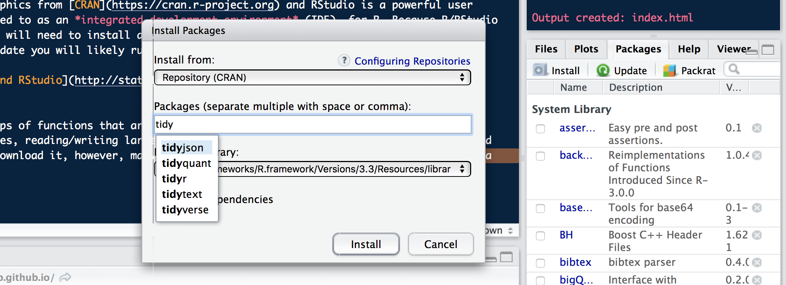

# R & R Studio
[R](https://cran.r-project.org) is a free programming language/software environment that allows users to analyze, model, and vizualize large data sets in much more powerful and complex ways than traditional spreadsheet programs like Excel or Google Sheets. Best of all, R is open source, meaning that it is freely available from the Comprehensive R Archive Network (CRAN) and anyone can contribute to making R better. In fact, numerous R packages (more on these later) are specifically designed for conducting analyses related to fisheries management. [RStudio](https://www.rstudio.com) is the powerful graphical interface that allows users to manage their code, data, and files all in one convenient program. 

Though R/RStudio may seem intimidating, it is actually quite straight forward to set up and, after learning a few basics, you can start running analyses and writing your own in no time. **The objective of this guide is to provide an introduction to R/RStudio basics so that interested resource managers without programming experience can start leveraging R for their management decisions.** 

## Installation
R and RStudio are **separate** programs and that need to be installed and updated individually. If you do not keep both relatively up-to-date you will likely run into problems. 

### R
To install R, go to the [list of CRAN mirrors](https://cran.r-project.org/mirrors.html) (universities and other organizations where you can download R from) and click on a link for a location near you. A few options are listed below.

+ [Indonesia](https://repo.bppt.go.id/cran/)
+ [Philippines](https://cran.stat.upd.edu.ph)
+ [Brazil](https://cran.fiocruz.br)
+ [US (West Coast)](https://cran.cnr.berkeley.edu)
+ [US (East Coast)](http://lib.stat.cmu.edu/R/CRAN/)

After navigating to the CRAN mirror site, click the download button for your operating system of choice (Linux, Max OS X, Windows) and then click on the most recent `.pkg` file and follow the instructions to complete the installation process. 

```{r, echo = F, warning=F}
library(knitr)
include_graphics('_data/r_download.png')
```

### RStudio
After installing R, visit the [RStudio Products](https://www.rstudio.com/products/rstudio/#Desktop) site and click the **DOWNLOAD RSTUDIO DESKTOP** button located partway down the page. 

```{r, echo=F, fig.width = 2}

```

Next, scroll to the bottom and click on the link under **Installers** that again corresponds to your operating system of choice.

```{r, echo=F, fig.width = 4}
include_graphics('_data/rstudio_installers.png')
```


Save the `.dmg` file on your desktop, open the file after it finishes downloading, and follow the instructions to complete the installation process. You can then delete the `.dmg` file.

Congratulations! You successfully completed the installation process and are one step closer to using R and RStudio for analysis!

## Getting Started with RStudio

### Packages
Packages are groups of functions that are designed to excel at certain tasks (making plots, standardizing dates, reading/writing large data files, etc.). Many useful packages come standard with R when you download it, however, many more are available online. 

To install a new package, click on the "Install" button located under the "Packages" tab in RStudio. This will open a pop-up where you can search for and install R packages hosted on CRAN. Alternatively, if you know the name of the package you want to install, you can run `install.packages('package_name')`.

```{r, echo=F, fig.height = 2}

```

Once installed, the packages you need for an analysis are loaded by the `library('package_name')` function. 

The following packages are commonly used by UCSB for fisheries analyses:

+ **tidyverse** - The tidyverse package actually contains numerous seperate packages for loading and writing data files (**readr**), data processing (**dplyr** & **tidyr**), plotting (**ggplot2**), and functional programming (**purrr**)
+ **readxl** - read and write data from/to Excel workbooks, including workbooks with multiple worksheets
+ **sf**, **rgeos**, **rgdal** - Key packages for spatial analyses similar to those done with ArcGIS
+ **rmarkdown** - Use R code to author reproducible reports, presentations, and websites
+ **shiny** - Create web applications using R

### Helpful Resources
+ [Installing R and RStudio](http://stat545.com/block000_r-rstudio-install.html) by Jenny Bryan