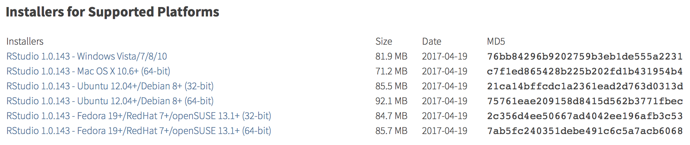

# Installation
Though R/RStudio may seem intimidating, it is actually quite straight forward to set up and, after learning a few basics, you can start running analyses and writing your own in no time. **The objective of this guide is to provide an introduction to R/RStudio basics so that interested resource managers without programming experience can start leveraging R for their management decisions.** 

R and RStudio are **separate** programs and that need to be installed and updated individually. If you do not keep both relatively up-to-date you will likely run into problems. 

## R
To install R, go to the [list of CRAN mirrors](https://cran.r-project.org/mirrors.html) (universities and other organizations where you can download R from) and click on a link for a location near you. A few options are listed below.

+ [Indonesia](https://repo.bppt.go.id/cran/)
+ [Philippines](https://cran.stat.upd.edu.ph)
+ [Brazil](https://cran.fiocruz.br)
+ [US (West Coast)](https://cran.cnr.berkeley.edu)
+ [US (East Coast)](http://lib.stat.cmu.edu/R/CRAN/)

After navigating to the CRAN mirror site, click the download button for your operating system of choice (Linux, Max OS X, Windows) and then click on the most recent `.pkg` file and follow the instructions to complete the installation process. 

```{r, echo = F, warning=F}
library(knitr)
include_graphics('images/r_download.png')
```

## RStudio
After installing R, visit the [RStudio Products](https://www.rstudio.com/products/rstudio/#Desktop) site and click the **DOWNLOAD RSTUDIO DESKTOP** button located partway down the page. 

```{r, echo=F}
include_graphics('images/rstudio_download.png')
```

Next, scroll to the bottom and click on the link under **Installers** that again corresponds to your operating system of choice.

```{r, echo=F}

```


Save the `.dmg` file on your desktop. Once it finishes downloading, open the file and follow the instructions to complete the installation process. You may then delete the `.dmg` file.

Congratulations! You successfully completed the installation process and are one step closer to using R and RStudio for analysis!

## Helpful Resources
+ [Installing R and RStudio](http://stat545.com/block000_r-rstudio-install.html) by Jenny Bryan