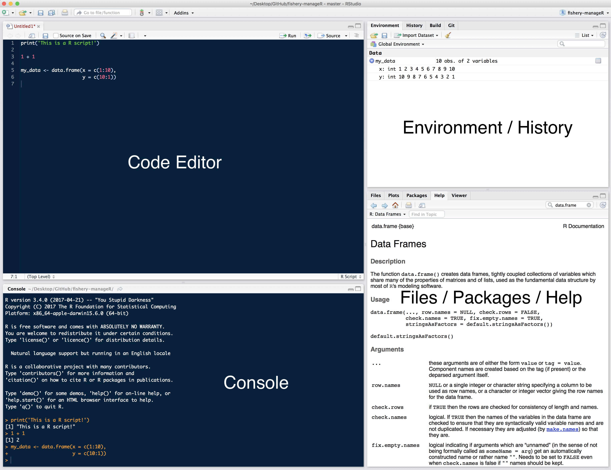
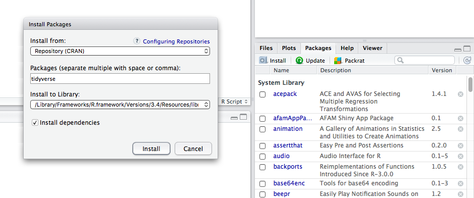

# Getting Started with RStudio
Rstudio is what's referred to as an Integrated Development Environment (IDE) for the R programming language. It provides a single interface for an R user to manage all aspects of an analysis (write code, manage and plot data. see outputs, get help, etc.). 

## RStudio Interface
There are four main panels in RStudio (Figure 1).

```{r, echo=F}

```

+ **Code Editor** - This is where you write the code for your analysis. Each tab represents a different R *script* file (e.g. `snapper_analysis.R`)
+ **Console** - This is where R prints the output of your code when it's run. You can also write code directly in the console after the `>` symbol
+ **Environment/History** - This panel generally has the following two tabs:
    + **Environment** - Displays all your data, variables, and user-defined functions. These are created by the user either in the code editor or directly in the console.
    + **History** - A list of your command history
+ **Files/Packages/Help/Viewer** - This panel contains numerous helpful panels:
    + **Files** - The list of all files contained in your current *working directory*. You can also navigate to different folders on your computer. This is where you can click on different R scripts to open them in the code editor.
    + **Plots** - When you produce plots with your code they will be displayed here
    + **Packages** - The list of packages (groups of functions) currently installed on your computer. You can install new packages or update existing packages from this tab by clicking `Install` or `Update`.
    + **Help** - Where you can search the R documentation to get help using the different R functions. This is a very useful feature of RStudio! You can also get help for a function by typing `?` followed by the function name in the console (e.g. `?data.frame()`).
    
## Working Directory{#work-dir}
The **working directory** is an important concept in R (and programming in general) and refers to the current directory (folder) that you are working in. Basically, R requires that you tell it where in your computer's file system it should start looking for files from. This is important because the code used to load data and save results and plots will differ depending on your current working directory. 

As an example, let's imagine you are working on an analysis of coral reef fisheries and you have a folder on your Desktop called `reef_fish`. Inside this `reef_fish` directory is the file `reef_fish_data.csv` that you want to analyze. Open RStudio and click `Set Working Directory...` under the `Session` menu in the toolbar. This asks you to specify the folder on your computer that R should consider to be the working directory. 

### Pathnames (Path)
Now that the working directory is set, you can load your reef fish data into RStudio by specifying the appropriate **pathname** to the file. In this case, the pathname is simply `reef_fish_data.csv` since the file is in the working directory and the data could be loaded with `read.csv(file = "reef_fish_data.csv")`. If, however, `reef_fish_data.csv` was actually stored in a subfolder called `data` the previous `read.csv()` command will not work because `reef_fish_data.csv` is not in the working directory. In this case, you can either tell R where the file is using the **absolute**, complete path (e.g. `/Users/You/Desktop/reef_fish/data/reef_fish_data.csv`), or with the path **relative** to the working directory (e.g. `data/reef_fish_data.csv`). 

## Packages
Packages are groups of functions that are designed to excel at certain tasks (making plots, standardizing dates, reading/writing large data files, etc.). Many useful packages come standard with R when you download it, however, many more are available online. 

To install a new package, click on the "Install" button located under the "Packages" tab in RStudio. This will open a pop-up where you can search for and install R packages hosted on CRAN. Alternatively, if you know the name of the package you want to install, you can run `install.packages('package_name')`.

```{r, echo=F}

```

Once installed, the packages you need for an analysis are loaded by the `library('package_name')` function. 

The following packages are commonly used by UCSB for fisheries analyses:

+ **tidyverse** -  Contains numerous seperate packages for loading and writing data files (**readr**), data processing (**dplyr** & **tidyr**), plotting (**ggplot2**), and functional programming (**purrr**)
+ **readxl** - Reads and writes data from/to Excel workbooks, including workbooks with multiple worksheets
+ **sf**, **rgeos**, **rgdal** - Key packages for spatial analyses similar to those done with ArcGIS
+ **rmarkdown** - Uses R code to author reproducible reports, presentations, and websites
+ **shiny** - Creates web applications using R

### Helpful Resources
+ [Jenny Bryan's Guide to Installing R and RStudio](http://stat545.com/block000_r-rstudio-install.html)
