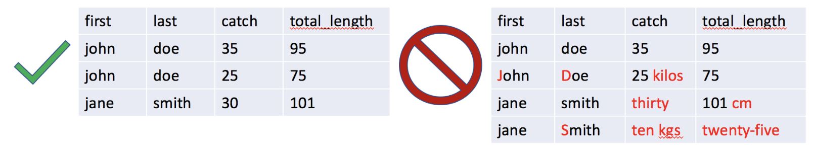

# Data Entry & Management

The careful entry, documentation, and management of data is essential to any data-related project. Being strategic about this process will keep the project organized, protect against data loss, and facilitate analysis and data sharing.

## Best Practices

1. **Using “flat” files and an open data format**  
Raw data should be entered as a “flat” table and saved using an open data format, such as .csv (comma separated values). “Flat” data files are tables where the first “header” row contains the variables in the data set and there is no internal hierarchy to the data. Nested columns and rows make analysis of the raw data outside of the original file very difficult.

```{r, echo = F, warning=F}
library(knitr)
include_graphics('images/data_mgmt_1.png')
```

2. **Organize data in a tidy format with unique records in rows, not columns**  
Data records should be stored in rows (long-format) instead of columns (wide format). This allows analysis within rows rather than across columns. This “tidy data” format means that each **variable** is saved in its own **column** and each **observation** is saved in its own **row**.

```{r, echo = F, warning=F}
include_graphics('images/data_mgmt_2.png')
```

3. **Describe data in a metadata file**  
Your raw **flat data files should only include data, no comments**. Rather than using complicated spreadsheets, create a metadata document, often called “README”, that includes (at a minimum) what data you are collecting, how and when the data were collected, where the data is stored, and who owns the data. This file should also include a “data dictionary” that describes each variable and associated unit in the data file (see example below). Be as specific as possible; for example, the description for fish length variables should include whether it is fork length, total length, or standard length.

```{r, echo = F, warning=F, fig.align='center'}

```

4. **Use clear and concise descriptive names for data files and variable names**  
File names are the easiest way to explain the contents of a data file. Capturing the place, time, and content of the data, even in an abbreviated fashion, can be extremely useful. For example, consider naming a fish catch monitoring file “muni_fishcatch_month_year.csv”, replacing “muni”, “month”, and “year” with the appropriate values. Similarly, each column in your data should contain a unique variable and be given a clear but concise name that uses letters, numbers, dashes, dots, or underscores. Lastly, always use plain ASCII text, as certain marks (e.g., accents) or characters (e.g., Chinese or Japanese) are not widely supported. File and variable names should NOT be overly long or contain spaces or special characters (e.g. *&$%@/)
    + **YES:** filename: *muni_fishcatch_month_year.csv* | variables: *year; first_name; last.name; TotalLength*
    + **NO:** filename: *November 2007.csv* | variables: *Start Year; First Name; Total weight (kg); $ Value*  
    

5. **Always use consistent formats for data values and (if necessary) put units in a separate column**  
When entering data, **do not mix text and numeric responses**, or include both text and numbers in the same response. Periods are okay to include for numeric responses but **avoid commas** (commas indicate a new value in a .csv file). For text values, such as a person’s name or location, take care not to change capitalization, spelling, spacing, etc. (e.g. John, john, jon) as this will generate confusion. **Consider using identification codes for variables with many possible categories (e.g., local species name, gear type)**. Units should always be in their own column or absent entirely but explained in the metadata file. Also, **do not use color coding**, it cannot be interpreted by other software (data in red below are just to demonstrate improper data entries).

```{r, echo = F, warning=F}

```

6. **Use standardized formats for dates**
When reporting full dates, use standardized formats since date representations vary between the United States and the rest of the world. For example, 01-09-17 will likely be interpreted as January 9th, 2017 in the U.S. but September 1st, 2017 or September 17th, 2001 in other countries. Therefore, always record dates using the international standard of YYYY-MM-DD as prescribed by the International Organization of Standards (ISO) standard ISO 8601 (2004). It is also generally good to have separate columns for **month** and **year** to facilitate analyses that are only interested in certain months or years (e.g. what are the average landings in March?).

7. **Always store an uncorrected original version of the data file and BACK UP YOUR DATA!!!**  
When you make changes or corrections to the original data file you could easily make a mistake. To avoid compromising your original raw data, always store an unadjusted copy of the data file and **do not make any changes or adjustments to this copy** (make it “read-only” if possible). Make a duplicate file if corrections or adjustments are required and be sure to describe what changes were made in the metadata file. Lastly, **ALWAYS BACK UP YOUR DATA** by keeping at least **three** copies of the file in different locations (e.g., desktop, external hard drive, the cloud).

## Helpful Resources
+ https://www.nceas.ucsb.edu/files/news/ESAdatamng09.pdf
+ http://ucsd.libguides.com/c.php?g=90957&p=585435